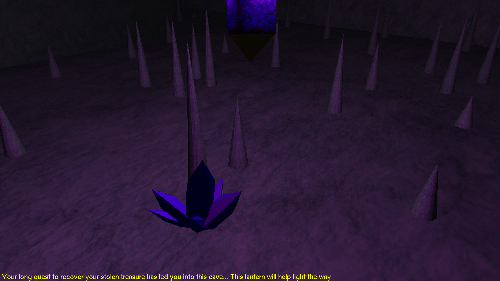
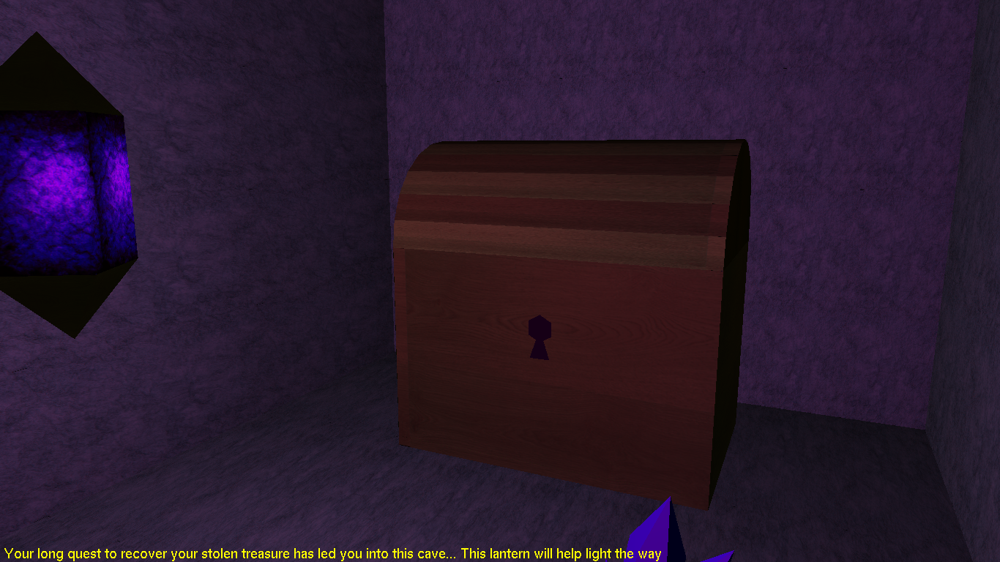
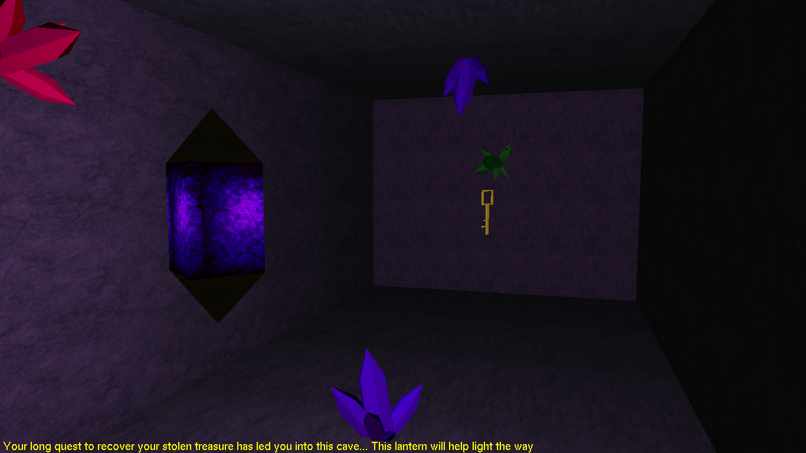

# Computer Graphics

Code for generating specific computer graphics projects running OpenGL. Each project marked point in time of learning to use OpenGL, final product in projects/final, 1 month after beginning to learn OpenGL.

Final project is first person game in cave. Objective: retrieve stolen treasure and escape.

## Screenshots of Final

Crystals and stalagmites decorating the cave.

Locked wooden chest holding your stolen treasure.

Key required to unlock treasure chest. After recovery, cave begins collapsing.

